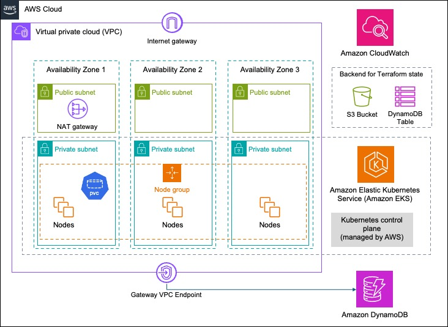

# XYZ Demo Infrastructure

This repository contains the [Terraform](https://www.terraform.io/) code to 
deploy an Elastic Kubernetes Cluster in Amazon Web Services (AWS).

Terraform backend state is stored in an S3 bucket with state locking enabled via a DynamoDB table. This setup ensures that multiple people can work with the pipeline and deploy simultaneously without causing conflicts by locking the state during operations like plan and apply.

Outputs from this infrastructure pipeline are persisted into the Terraform backend state so they can be read by he application pipeline ([xyz_app_poc](https://github.com/setheliot/xyz_app_poc)) that uses this infrastructure.

The deployment is currently configured to deploy to a staging environment first (from the `stage` branch) and then to a production environment (from the `main` branch). Other environments can be added.

| Environment type    | Short name | Branch     | Notes   |
| --------            | -------    |-------     | -------        |
| Production          | prod       | main       | Default branch |
| Staging             | stage      | stage      | The only source of pull requests into prod |
| Development         | dev        | (varies)   | Created by developers for pull requests into stage. They use their own AWS accounts as environments. |

## Infrastructure architecture

This code provisions several AWS resources, including:
- Virtual Private Cloud (VPC)
- 3 Public Subnets
- 3 Private Subnets
- NAT Gateway
- Internet Gateway
- Elastic Kubernetes Service (EKS) Cluster
- CloudWatch log group for the EKS Cluster
- EKS managed node group, backed by an EC2 Auto Scaling group
  -  `min_size = 1` and `max_size = 5` - this can be adjusted in [main.yml](terraform/main.tf)
- Security Group for the cluster nodes
- Subnets and nodes are distributed across 3 availability zones
- DynamoDB table
- VPC Endpoint to the DynamoDB service
- It also attaches managed IAM policies to the EKS node role

After the EKS cluster is deployed, this code then installs AWS Load Balancer Controller using Helm. This can be used by applications to create elastic load balancers (ALB or NLB).

**Cost** 
- The rough estimate of the cost to run this infrastructure is about $200/month ([details here](https://calculator.aws/#/estimate?id=e44ce3d3abfb08aaed9e531aee28d831de131b99)) _per environment_.
- This cost will be affected much traffic is served, number of nodes, DynamoDB requests, or whether you require Kubernetes extended support.
- A significant cost of about $60 is for three VPC endpoint Private Links across all three AZs (it is about $21 per PL for three AZs). These are used for SSM Session Manager access to nodes. You can remove these and instead go over the public internet using the NAT GW.

## CI/CD automation

The pipeline automation here currently only supports `stage` and `prod` environments.

The AWS Regions for the each of these should be different. You configure the Regions to use in [`stage.tfvars`](terraform/environment/stage.tfvars) and  [`main.tfvars`](terraform/environment/main.tfvars) respectively.

Developers create their own `dev` branches to work in (using their own accounts as environments) and then create pull requests from these into `stage`

Three GitHub actions workflows are defined:

- **Terraform** ([`terraform.yml`](.github/workflows/terraform.yml)) initializes and provisions the infrastructure defined in the configuration files for the `stage` and `prod` environments.
- **Enforce Flow** ([`enforce-flow.yml`](.github/workflows/enforce-flow.yml)) enforces the order in which changes flow through the environments in the pipeline. Currently with only the two environments, it enforces that `prod` will only accept merges from `stage`. It also checks that all tests in the previous environment have passed before accepting the merge.
- **Environment Tests** ([`ci.yml`](.github/workflows/ci.yml)) runs tests applicable to _every_ environment. The workflow exists as a placeholder to add future tests. Note: **Stage Tests** and **Prod Tests** workflows can similarly be created for tests that only apply to a specific environment.

The following GitHub rules are enforced on branches `stage` (staging) and `main` (production)
- **Require approvals**: Requires at least one code review with resolution before merging.
- **Require a pull request before merging**: Require all commits be made to a non-target branch and submitted via a pull request before they can be merged.
- **Require status checks to pass**:
  - Checks **Enforce Flow** to ensure pull requests are only accepted from the designated previous environment in the pipeline, after all tests have passed on it.
  - Checks **Environment Tests** to ensure all environment tests pass on the  current environment.

The following [GitHub environments for deployment](https://docs.github.com/en/actions/managing-workflow-runs-and-deployments/managing-deployments/managing-environments-for-deployment) are defined: [`stage`](https://github.com/setheliot/xyz_infra_poc/deployments/stage), [`prod`](https://github.com/setheliot/xyz_infra_poc/deployments/prod)

## How to use
1. Clone the repository.
1. Create an IAM User in the AWS account you wish to use, with the necessary credentials (see [below](#future-plans)). Enter `AWS_ACCESS_KEY_ID` and `AWS_SECRET_ACCESS_KEY` values for that IAM User in GitHub secrets (Settings ➡ Secrets and variables ➡ Actions ➡ New repository secret)
1. Create an S3 bucket and DynamoDB table in a Region in this same account to use for the backend store for Terraform state
   - For the DynamoDB table use `LockID` (type String) as the partition key.
   - Update the `bucket` name, `dynamodb_table` name, and AWS `region` values in [`providers.tf`](terraform/providers.tf) under the **Remote backend** setting.
1. [optional] Update [`stage.tfvars`](terraform/environment/stage.tfvars) and [`main.tfvars`](terraform/environment/main.tfvars) to set the `aws_region` you want to use for each. These must be different than each other.
1. The staging environment infrastructure will automatically build when you merge a pull request into branch `stage`.
1. The production environment infrastructure will automatically build when you merge a pull request from branch `stage` into branch `main`.

## Future plans
- Add other environment stages to the pipeline, such as `test`

- Environments deploy to separate AWS accounts instead of separate Regions in the same account
   - This provides better fault isolation between environments
   - This maintains closer parity between environments since availability of services and instance types can vary with Region
   - To implement this would require specifying AWS credentials for each account used in GitHub Secrets, and then adding logic to the `terraform.yml` GitHub action to select the appropriate credentials based on environment type.

- Improved AWS authentication
   - AWS recommends using short lived credentials such as an IAM Role instead of IAM User (long lived credentials)
    - `aws-actions/configure-aws-credentials` can use IAM Roles if you setup a GitHub OIDC provider in the AWS account.

- Provide a sample IAM Policy for AWS credentials that follows the principle of least-privilege. The AWS credentials used here require the following permissions:
   - EC2 actions: Required for creating and managing VPCs, subnets, NAT gateways, and security groups.
   - EKS actions: Needed for creating and managing the EKS cluster and node groups.
   - IAM actions: Needed for creating and managing IAM roles and attaching policies (like the EKS cluster role).
   - Auto Scaling actions: Required for managing EKS-managed node groups since they use auto-scaling groups.
   - STS AssumeRole: Allows the EKS service to assume the IAM role for the cluster.

- Improve how Terraform is used to deploy multiple environments
   - In this current implementation we make use of multiple `.tfvars` files and [Terraform workspaces](https://developer.hashicorp.com/terraform/cli/workspaces).
   - However there exists built-for-purpose systems like [Terragrunt](https://terragrunt.gruntwork.io/) for this.

- Supply an the Terraform configuration to create S3 bucket and DynamoDB table for Terraform backend state